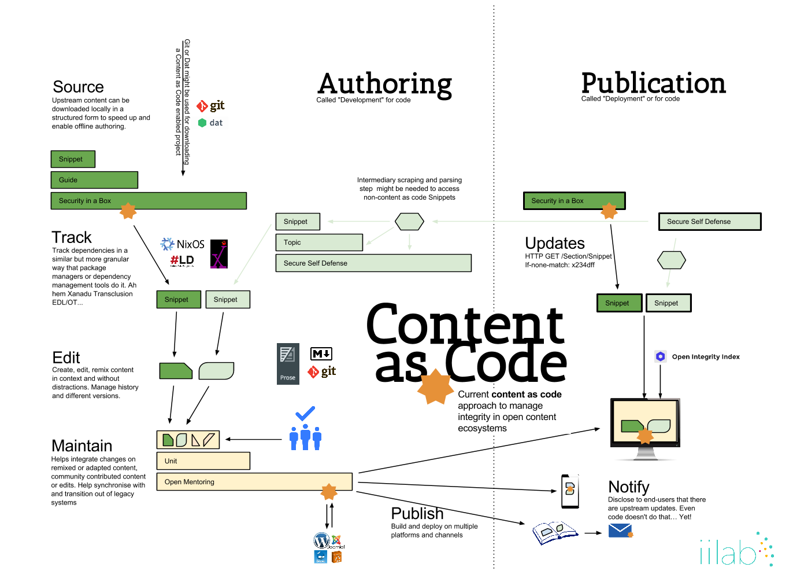

## Goals

**Content as Code** is an approach to develop workflows and technology to improve content re-use and maintainability.

It aims to **make content authoring and management benefit from software engineering collaboration best practices**.

Our **design goals** are to enable:

 - [Focused Writing](approach/#focused-writing)
 - [Localisation and translation](approach/#localisation-and-translation)
 - [Low barrier to collaboration](approach/#low-barrier-to-collaboration)
 - [Track changes and manage contributions](approach/#track-changes-and-manage-contributions)
 - [Content Reuse](approach/#content-reuse)
 - [Multiple publication channels](approach/#multiple-publication-channels)

Our [**technology approach**](technnology) builds on top of lightweight tools that separate concerns (instead of large monolithic frameworks as generally seen in CMSes):

 - Using **Git** for version control
 - Using **Markdown** and enhanced flavors of Markdown for authoring
 - Support **dependency tracking** at the fragment level.
 - Support **static website generation** and interoperability with **content management systems**
 - Support a **micro-service** approach to providing commenting, statistics and other dynamic features.

## Who?

Content as code is supported by a partnership. The partnership brings together implementers contributing to projects publishing free/libre and open source content and wanting to have lightweight (post-CMS) approaches to content management that focus on the **author experience** (as well as editor and translator experience).

Read more about:

 - Our [approach and goals](approach) to editorial workflows
 - The [technology](technology) supporting content workflows
 - The [partner projects](partners)
